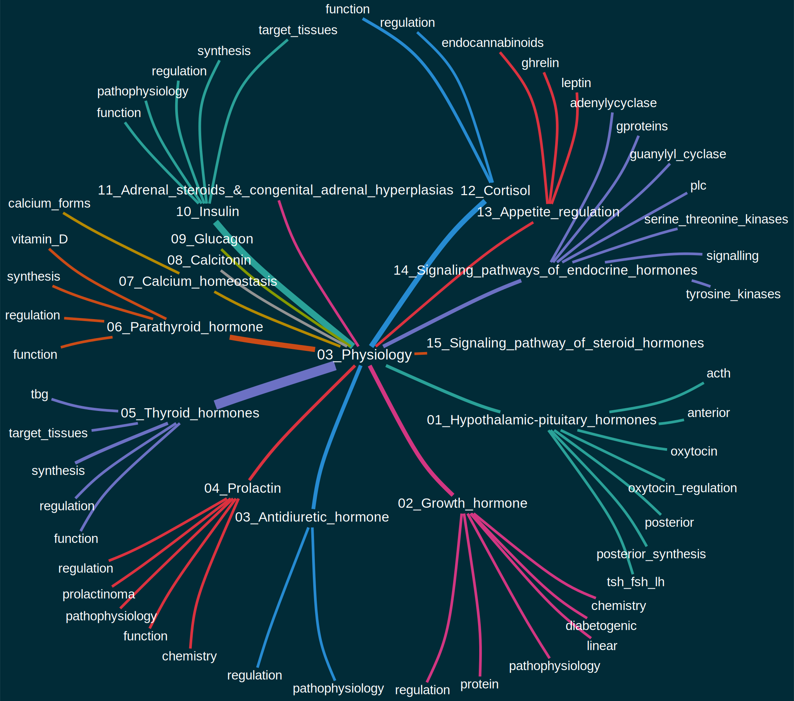
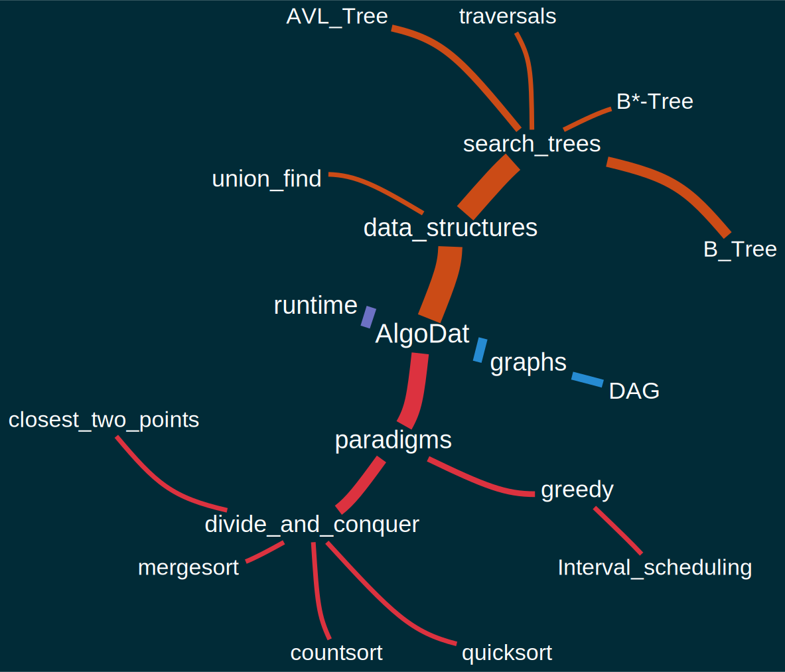
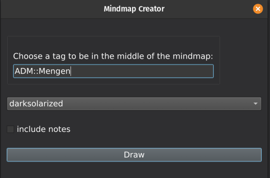

# Anki-Mindmap
Anki-Mindmap is an addon for the spaced repetition flashcard app [Anki](https://apps.ankiweb.net/) that allows you to create mindmaps/graphs/visualizations out of tag hierarchies.

### Results

### Screenshot

### Installation
#### Dependencies
This addon needs [graphviz](https://graphviz.org/download/) to be installed and to be on the PATH.
Make sure to check "Add to path for all users" during installation.

#### AnkiWeb
The easiest way to install Anki-Mindmap is through [AnkiWeb](https://ankiweb.net/shared/info/965278890).
