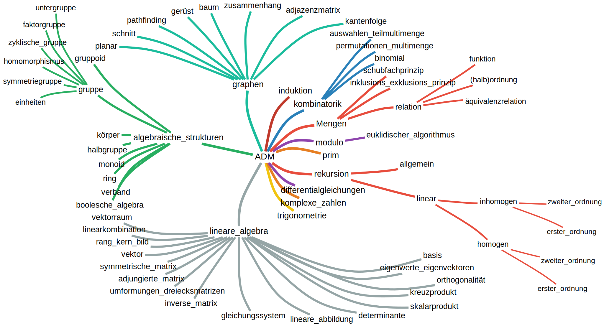
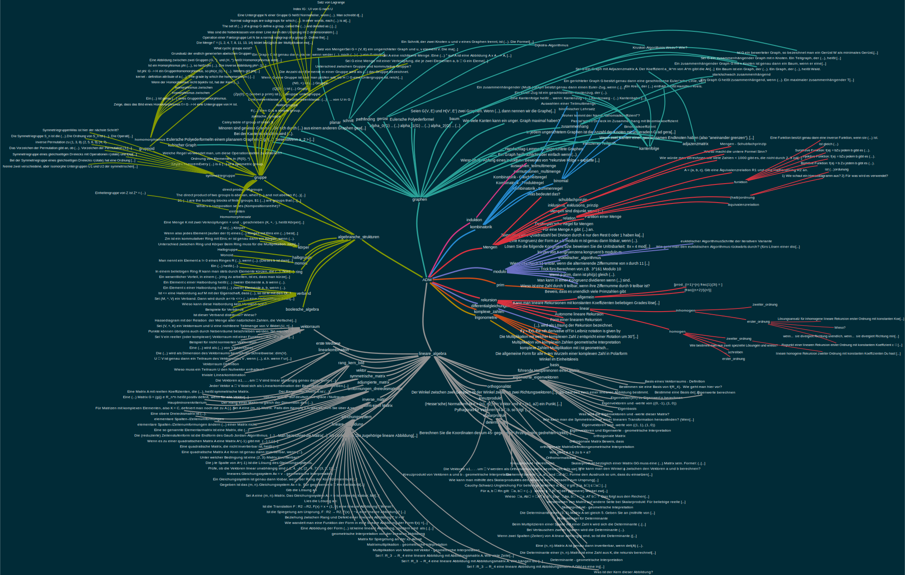
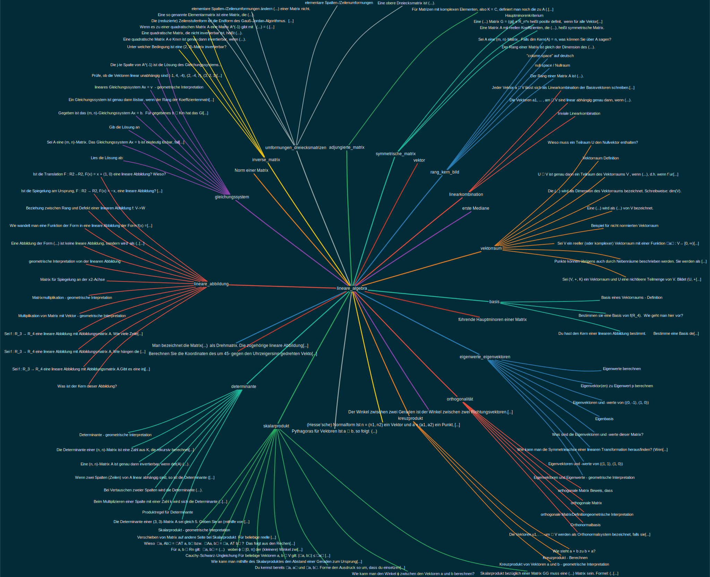

# Anki-Mindmap
Anki-Mindmap is an add-on for the spaced repetition flashcard app [Anki](https://apps.ankiweb.net/) that allows you to create mindmaps/graphs/visualizations out of tag hierarchies. To have hierarchies of tags in Anki, you need another addon, for example [Hierarchical Tags 2](https://github.com/glutanimate/hierarchical-tags) or [BetterTags](https://www.patreon.com/posts/bettertags-v1-0-36497547). It is expected that hierarchical tags will be a available in Anki by default in the near future.

### Results

### Installation
#### Dependencies
This addon needs [graphviz](https://graphviz.org/download/) to be installed and to be on the PATH.

#### AnkiWeb
The easiest way to install Anki-Mindmap is through [AnkiWeb]().
